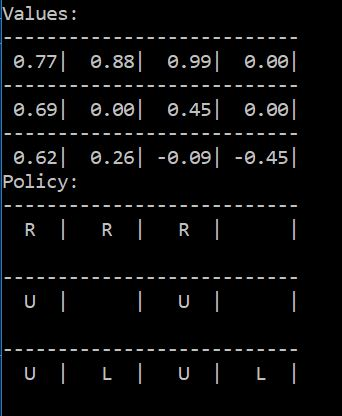

### Approximation Methods

- State space could be huge or it even might be a non-episodic task and hence determining the value for each state could be very expensive.

- Therefore we approximate V[s] and Q[s,a] using neural networks.

#### Monte Carlo Evaluation Using Approximation
Here we use linear regression to determine theta which gives minimum error for:

                         `V_hat = theta.x`

where V_hat is the prediction for value function given a state and x is the feature vector representing that state.

We apply stochastic gradient descent to calculate the gradient and change the parameter (theta):

              `theta = theta + alpha*(G - V_hat)*x`

 file contains the implementation.

  

