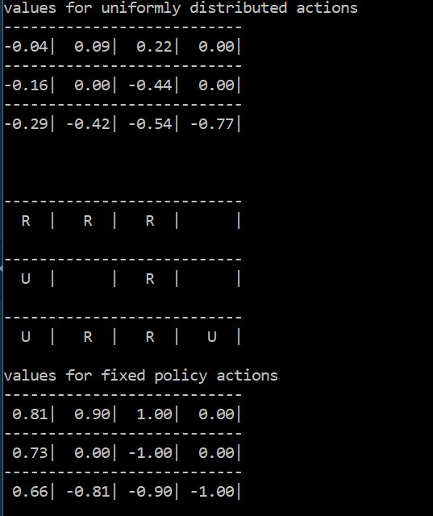
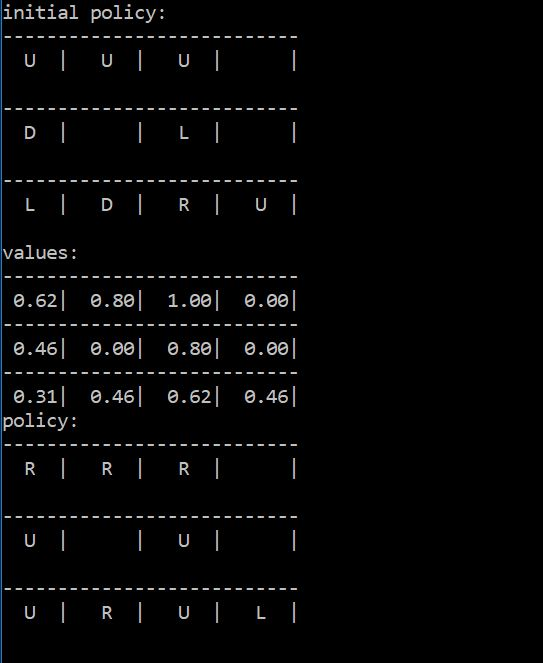
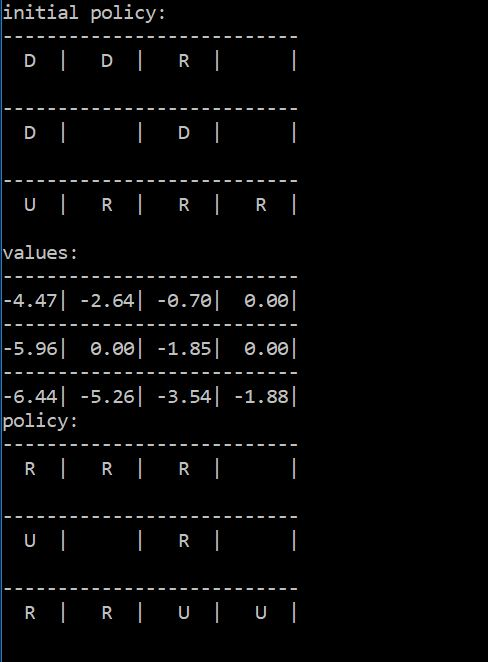
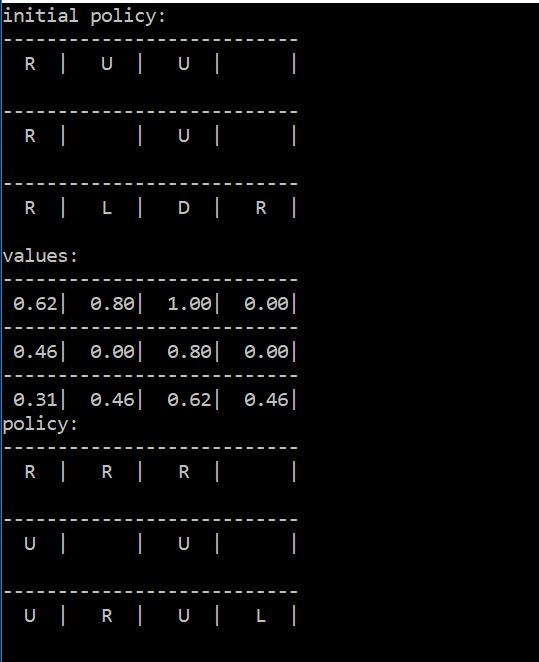

## Dynamic Programming

- DP is one of the approches to solve MDP.
- This module will implement gridworld (and its variants) and solve it using DP.
- There are two problem definitions while solving an MDP:
  ##### Prediction Problem
  Given a policy, detemine the value functions using **policy evaluation** method.

  state,rewards = play_game(given a policy)

  ##### Control Problem
  Find the optimal policy by oscillating between policy evaluation and **policy iteration**.

  state,actions,rewards = play_game(for current policy)

- Both the problems use Bellman equation in different forms.

#### Policy Evaluation
This method is used to determine value function given a policy. Value function is determined by using the bellman equation _pi(a|s)*p(s',r|s,a)*(V[s] = r + gamma*V[s'])_

 file implements policy evaluation for a uniformly distributed policy (pi(a|s) = 1/4) and a fixed policy (pi(a|s) = 1).

  

Above snippet shows the value functions of each state for two different policies.

#### Policy Iteration
This method is used to find the optimal policy by using the Bellman equation. Max Q value is determined by iterating through all the actions and finding the argmax. After every policy change, value funciton is re-calculated.

  

 we initialize the policy randomply and then perform policy iteration to determine the optimal policy.

#### Windy Gridworld
In above implementations the probability of landing into s' from s after taking an action a is deterministic. But this might not be the case in every environment. So  stochastic moves are implemented. The agent will move in the chosen direction with a probability of 0.5 and in the rest 3 directions with a probability of 0.5/3 each.

  

As expected, the value functions are different from deterministic moves but still the optimal policy remains same as the probability of taking the selected action is highest (if not 1).

#### Value Iteration
In above methods we first wait for the policy evaluatoin to converge and then run policy iteration every time. This might become inefficient in larger grids and more states.

For a , policy iteration is done is the same loop as policy evaluation. And then after convergence just find the optimal policy (which is already determined).

  

