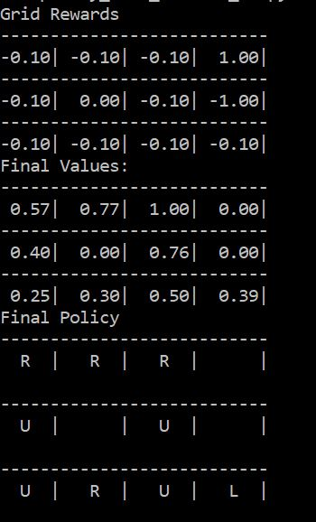

## Monte Carlo Simulation

- In dynamic programming we never actually play the game and learn. We update the probability disrtibution by taking every action in a perticular state.
- In Monte Carlo we play the complete episode and then calculate the sample mean instead of expected mean. Hence it is not a "fully online" algorithm. We wait for the episode to finish unlike in DP where we update after every action.
- Same pattern as before - Control and prediction problems.

### Calculation of Sample Mean of G (future rewards)
- Play a number of episodes and record the rewards for all the encountered states (s,G).

#### First visit method
Count the return only for the time instant which comes first.

#### Every visit method
Count the return for each instant in which we counter that state.

- MC updates the states only we visit. We don't need to loop through all the states like in DP. We explore the states as we play.

### MC Policy Evaluation
It is similar to the earlier implementation. We define a policy and calculate the V[s] for each state following that policy. This is done by playing a bunch of games and recording the rewards at each state. After each episode, G for each state is calculated and updated in V[s].  file contains the implementation.

  

##### Windy gridworld
In the above code there is no need for MC since all the future rewards are deterministic. We don't need to play so many games. But in windy gridworld the rewards are stochastic ands hence requires sample mean to be calculated using Monte Carlo simulation.  contains the implementation.

  

### MC policy Iteration
In finding the optimal policy we store the tuple of (s,a,r) in Q(s,a) and find the argmax[a]{Q}.

#### With Explore-Start method
In this method to reach to every action-state-reward tuple we randomize the starting state and the action and later on follow the policy. To avoid looping we keep a check of seen_states and assign the rewards accordingly. After playing an episode, just like policy evaluation, we calculate G for each (s,a) and store it in Q. Later for optimal policy calculation we find the action which give the max return for that state hence no need to perform the actions every time.  contains the implementation.

  

#### Without Explore-Start Method
In this method we keep the start state as constant and choose the starting action according to explore-exploit solution. 0.5 probability of choosing the current policy and 0.5 to choose one of the other 3 actions.

  

