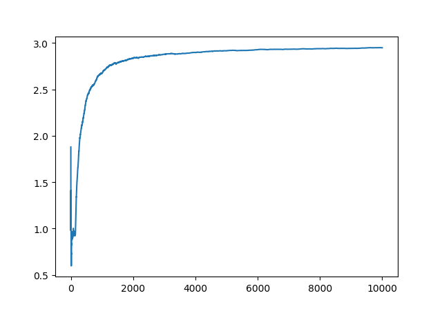
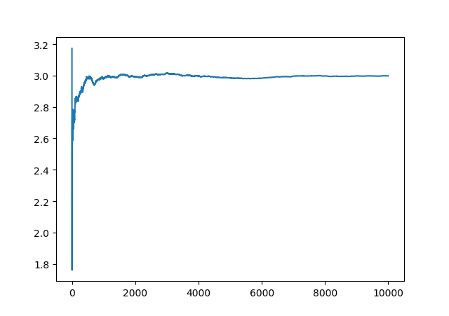

## Return of Multi Armed Bandit

- In this module, three different algorithms are explained and implemented to solve the explore-exploit dilemma.

### Problem Statement

- There have 3 slot machines with different winning probabilities which only can be know by collecting data. Goal is to maximise the winning rate.
- Balance Exploring (collecting data from all machines) + Exploiting (playing with the best-so-far machine).
- Algorithms explained to solve this dilemma are:

1. Epsilon Greedy 
2. Optimistic Initial Value

Before getting into the algorithms - 

- Outcome of machine can be modeled either as binary (0 or 1) or by a Gaussian Random Variable with variance 1.
- In this implementation Gaussian distributed outcomes are considered. Each machine has its own mean and we have to maximise the average outcome of our experimentation.
- For binary outcome only few changes need to be done which will be shown later.

### Epsilon Greedy Algorithm

- In this method we select an epsilon value (much smaller compared to 1). It is the probability with which we 'explore' i.e. randomly select any machine collect sample.
- (1 - epsilon) is the probablity with which we 'exploit' i.e. use the best-so-far machine to collect sample.
- [This](epsilon-greedy_bandit.py) python file implements this algorithm and is used to generate this graph of cumulative average after each turn.

  

### Optimistic Initial Value

- An initial value for mean is selected which would be much more than expected. 
- Only greedy operation is executed i.e. only 'exploit'.
- After every update, the mean of the machine is lowered bringing it closer to the actual values.
- The optimistic initial value balances the exploit-explore situation as the not-so-explored machine will have high mean value and hence would be the choice to play with.
- Gives better results than Epsilon-Greedy.
- [Here](optimistic-initial-value_bandit.py) is the implementation and below is the graph

  

