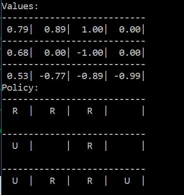
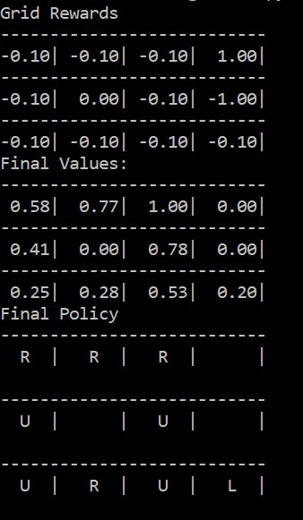
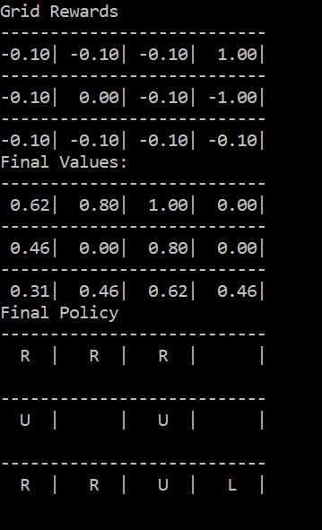

## Temporal Difference Learning
- It has advantages of both Dynamic Programming and Monte Carlo.
- Unlike DP it doesn't need to go through all the states.
- Also, one doesn't need to wait for the episode to get over to update values and policy.

#### Prediction
##### TD(0)
It uses the recursive nature of the Value function to evaluate a policy.

V(s) = V(s) + alpha*[G(t) - V(s)]

V(s) = V(s) + alpha*[r + gamma*V(s') - V(s)]

This is completely online as we don't have to wait for the episode to complete (G(t) is not involved). We can update at every step.

 file contains the implementation.

  

#### Control
##### SARSA
It is basically TD(0) for control problem. Here we store Q(s,a) instead of V(s) and use the same update equation. The name comes from the variables stored - s, a, r, s', a'.

Q(s,a) = Q(s,a) + alpha*[r + Q(s',a') - Q(s,a)] where s' and a' are the next state and action.

 file contains the implementation.

  

##### Q-Learning
This is based on off-policy method i.e. we choose random actions instead of greedy policy and still get to the optimal policy. It doesn't matter what policy we follow. This is infact the only difference between Q-Learning and SARSA.

 file contains the implementation.

  

